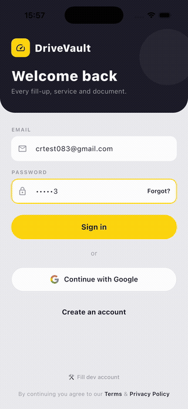
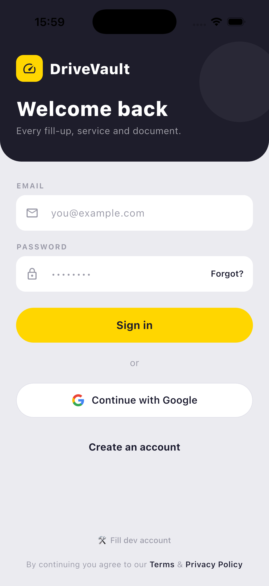
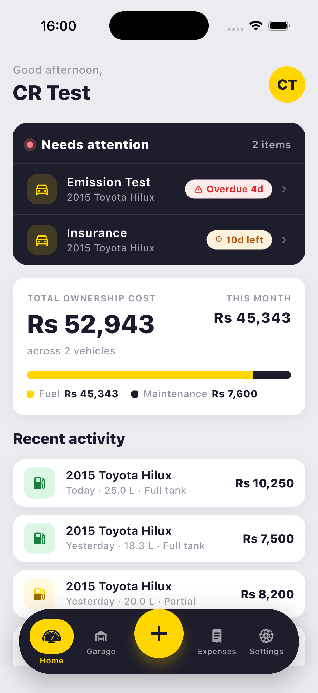
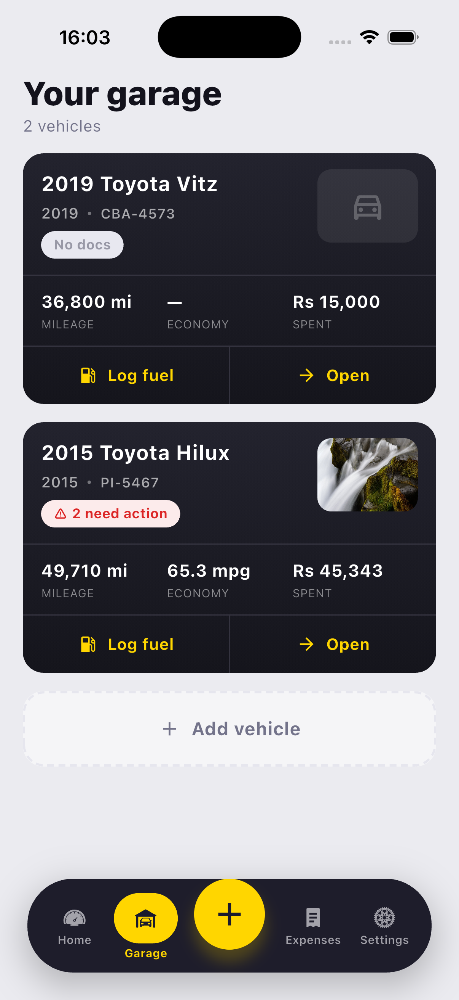
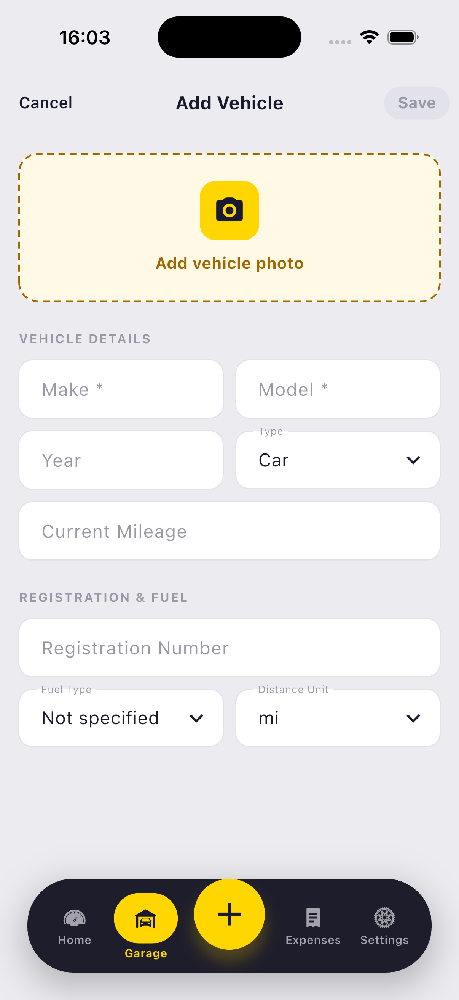
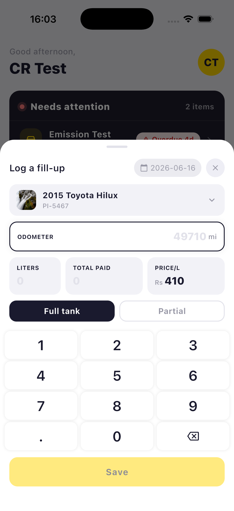
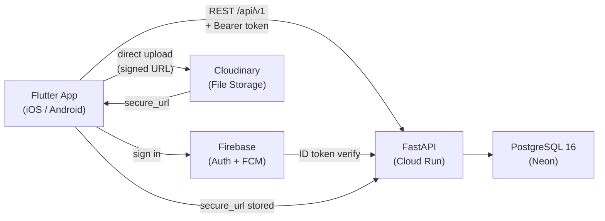

# DriveVault

> The single source of truth for your vehicle — maintenance, fuel, expenses, and documents. From first mile to resale.


---

## Demo



<sub>[▶ Watch full recording](assets/demo.mov)</sub>

---

## Screenshots

<table>
  <tr>
    <td></td>
    <td></td>
    <td></td>
    <td></td>
    <td></td>
  </tr>
  <tr>
    <td align="center">Sign In</td>
    <td align="center">Dashboard</td>
    <td align="center">Garage</td>
    <td align="center">Add Vehicle</td>
    <td align="center">Fuel Log</td>
  </tr>
</table>

---

## What it is

DriveVault is a full-stack mobile application for vehicle owners to track fuel, maintenance, expenses, and documents in one place. Built as a real-world product from a formal PRD through schema design, API contract, and implementation — Phase 1 (Foundation MVP) is complete and deployed.

---

## Tech Stack

| Layer | Technology | Why |
|---|---|---|
| Mobile | Flutter 3.44 + Riverpod 3 + go_router | Cross-platform, single codebase |
| Backend | FastAPI 0.115 + SQLAlchemy 2 + Alembic | Async Python, typed, Swagger auto-docs |
| Database | PostgreSQL 16 (Neon) | Relational integrity; pgvector-ready for Phase 6 AI |
| Auth | Firebase Auth | Email/password + Google SSO, tokens verified server-side |
| File storage | Cloudinary | Direct client upload — file bytes never touch the API server |
| Hosting | Google Cloud Run (min-instances=0) | Always-free tier, auto-scales |
| Push | Firebase FCM | Service reminders (Phase 2+) |

---

## Architecture Overview



---

## What's Built (Phase 1)

- **Auth** — Firebase email/password + Google Sign-In; ID tokens verified server-side via Firebase Admin SDK
- **Vehicles** — add, edit, delete with photo upload; live stats on garage card
- **Fuel logs** — odometer sync, full/partial fill tracking, interval-method economy calculation
- **Maintenance records** — manual logs with category filtering and photo attachments
- **Document vault** — store registration, insurance, and other docs with expiry tracking
- **Expense history** — unified view across fuel, maintenance, and documents
- **User profile** — display name, currency preference, distance unit preference
- **REST API** — 25 endpoints, strict ownership model (cross-user access → 404), full Alembic migration history
- **Deployed** — backend live on [Google Cloud Run](https://drivevault-backend-250609806849.us-central1.run.app/docs); Flutter app runs on iOS simulator and device

---

## What's Next

| Phase | Focus |
|---|---|
| 2 | Service reminders + push notifications (FCM) |
| 3 | AI maintenance predictions (Gemini API) |
| 4 | OCR receipt scanning (ML Kit on-device) |
| 5 | Offline-first sync (Drift + conflict resolution) |
| 6 | Resale value intelligence (pgvector embeddings) |

---

## Local Development

**Prerequisites:** Flutter 3.44+, Python 3.12+, Docker, Firebase project credentials

```bash
# Backend
cd backend
python3 -m venv .venv && source .venv/bin/activate
pip install -e ".[dev]"
docker compose up -d          # local Postgres on :5433
cp .env.example .env          # add Firebase + Cloudinary credentials
uvicorn app.main:app --reload # → http://localhost:8000/docs

# Mobile
cd mobile
flutter pub get
flutter run --dart-define=API_BASE_URL=http://localhost:8000
```

---

## Project Structure

```
drivevault/
├── backend/              # FastAPI application
│   ├── app/
│   │   ├── routers/      # request parsing only — no business logic
│   │   ├── services/     # business logic + DB access
│   │   ├── schemas/      # Pydantic request/response shapes
│   │   └── models/       # SQLAlchemy ORM models
│   └── tests/
├── mobile/               # Flutter application
│   └── lib/
│       └── features/     # auth, vehicles, fuel, maintenance, documents, …
│           └── */
│               ├── data/         # repository + API client calls
│               ├── domain/       # domain models
│               └── presentation/ # screens + Riverpod providers
└── docs/                 # PRD, tech spec, schema, API contract
```

---

[GitHub →](https://github.com/donkasun/DriveVault) · [Live API →](https://drivevault-backend-250609806849.us-central1.run.app/docs) · [Full product vision →](docs/DriveVault_PRD.md) · [Architecture & design decisions →](ARCHITECTURE.md) · [API contract →](docs/03-api-contract.md) · [Database schema →](docs/02-database-schema.md)
